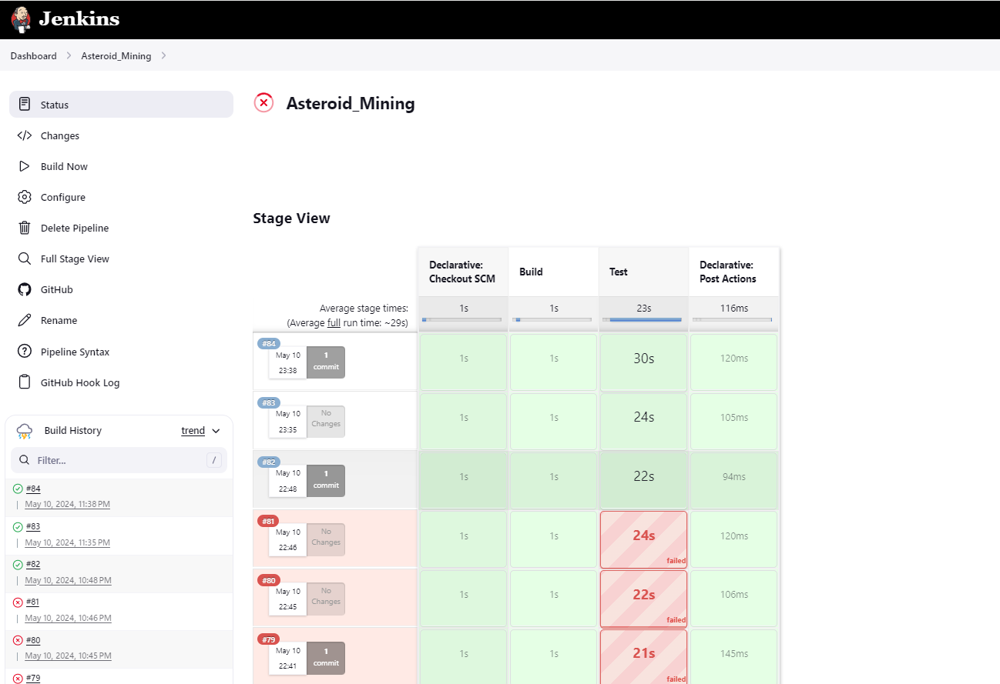

#  Continuous Integration (CI) and Continuos Deployment (CD):

Jenkins can automatically build and test code changes whenever they are pushed to the repository. This helps in identifying and addressing issues early in the development cycle as it  automates the software delivery pipeline, enabling teams to deliver high-quality software efficiently and reliably.
Building a Jenkins Pipeline involves:
1. Installing Jenkins on the local machine.
2. Setting up a Jenkins Job - Since we are using a maven project that is available on GitHub, we had to add Maven plugins and GitHub plugins to be able to build the project on Jenkins. 
3. Creating a Pipeline script -  In the project configuration we chose to define a pipeline script using a Jenkinsfile which should be added to the maven project. This file defines the instructions for our pipeline:
                                 (1) Build stage
                                     clones the main branch of the project in Github and performs a maven clean 
                                 (2) Test stage
                                     Runs unit tests and generates the test reports
                                 (3) Post block
                                     Defines actions that should be taken after the execution of the pipeline stages, regardless of whether they succeed or fail
To be able to receive real-time information on Jenkins about changes made in the repository, we used Webhooks. Since we had installed Jenkins on our local machine we had to use Ngrok to expose our local server to the internet to be able to integrate Jenkins with GitHub. Whenever any change is made in our repository Jenkins will automatically run a build which includes those changes. 

## Lessons learnt:
- I have learnt configuring Jekins for a maven project
- Integrated Jenkins with GitHub using webhooks
- Using Ngrok to expose Jenkins running on the local machine to the internet. 

