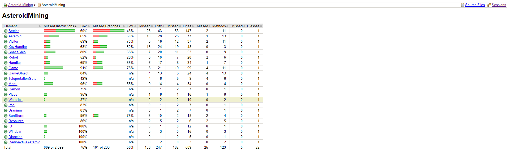

# Unit Tests and Code Coverage
Unit tests are designed to validate individual components or pieces of code, ensuring they function as expected in isolation. By integrating Jenkins and Maven, it's possible to automate the execution of these tests, providing continuous feedback on the health of the codebase.

Code coverage metrics, meanwhile, measure the extent to which the source code is tested by unit tests, helping to identify untested or under-tested parts of the code. This information is crucial for guiding further test development and ensuring comprehensive testing coverage across the project

#
# 1 Creating and/or extending Junit Tests
Starting from a baseline where no unit tests were present in the project posed an initial challenge but also presented a significant opportunity for improving the software's reliability and maintainability.

By integrating Maven into the project setup, it was possible to streamline the addition of dependencies and manage the overall build process more effectively. This integration facilitated the inclusion of JUnit.

Here's how JUnit tests are set up and executed in a Maven environment:

    1.1 Adding Dependencies: First, the necessary JUnit dependency is included in the Maven pom.xml file. This tells Maven to download and add JUnit to the project's classpath, enabling its use within the project. 

    1.2 Configuring the Surefire Plugin: Maven uses the Surefire Plugin to execute unit tests. 
    
    1.3 Viewing Test Results: After running the tests, Maven stores the results in the target/surefire-reports directory. This directory contains text and XML reports that provide detailed information about each test's execution, including success, failure, and the time taken to run each test.
 
    1.4 Integration with CI Tools: In a continuous integration (CI) environment, such as Jenkins, Maven projects are typically configured to run mvn test as part of the build pipeline. This ensures that all tests must pass before a build is considered successful, which is crucial for maintaining code quality and functionality through various stages of development.

The tests developed focused primarily on the main functionality and behavior of the application. This approach ensured that the most critical and core aspects of the software were thoroughly tested, thereby minimizing the risk of regressions and bugs in the most frequently used features. By targeting these key areas, the tests not only validated the functionality but also helped document the expected behaviors of the system, serving as a reference for future development and maintenance.

The following JUnit tests were initially created:

    1 CarbonTest.java
    2 DorectionTest.java
    3 IDTest.java
    4 IronTest.java
    5 RadioActiveAsteroidTest.java
    6 WaterIceTest.java

Overall, these tests aim to verify the fundamental properties and behaviors of the classes — specifically, its identification and visual representation within the software, ensuring they meet the expected standards and functionalities required by the application.

#
# 2 Measuring the Code Coverage
Measuring code coverage is a crucial aspect of maintaining high-quality software, and in this project, JaCoCo was employed to undertake this task. JaCoCo, a widely used Java Code Coverage Library, integrated into projects managed with Maven.

Incorporating JaCoCo into a Maven project not only automates the process of measuring code coverage but also simplifies the generation of detailed reports. To generate a code coverage report using JaCoCo within a Maven-managed project, developers typically use the Maven command mvn test. This command triggers the execution of the test suite and JaCoCo begins its analysis of how much of the codebase the tests cover.

Here's a step-by-step overview of how JaCoCo integrates with Maven to produce coverage reports:

    2.1 Configuration in pom.xml: JaCoCo is configured in the project's pom.xml file, within the <build> section. This configuration specifies the JaCoCo plugin and its goals, such as prepare-agent to enable coverage instrumentation and report to generate the coverage report after tests are run.
     
    2.2 Running Tests: When the mvn test command is executed, Maven compiles the project's code, runs the unit tests, and JaCoCo instruments these tests to measure the coverage. This process is fully automated as part of the build cycle configured in Jenkins.

    2.3 Generating the Report: After the tests complete, JaCoCo generates a coverage report. This is configured to happen automatically by binding the JaCoCo report goal to a Maven phase such as test, verify, or package. As a result, the coverage report is generated immediately after the tests run.

    2.4 Accessing the Report: The generated coverage report is saved in the target/site/jacoco directory of the Maven project. This directory contains various files that provide a visual and navigable coverage report, which can be viewed in any web browser. The report includes detailed coverage metrics, such as the percentage of lines covered, branches covered, and missed lines, offering a clear and comprehensive view of the coverage landscape.

    2.5 Continuous Integration: In a CI environment like Jenkins, these steps are automated. Every time code is pushed to the repository, Jenkins triggers a build which includes running the "mvn test" command. The results, including the JaCoCo coverage report, are then made available as part of the build output. Developers can access these results directly from the Jenkins dashboard, where links to the coverage reports are typically provided for easy access and review.

Initially, the code coverage results revealed a coverage of just 37%. This low percentage was concerning as it indicated that a significant portion of the codebase lacked sufficient testing, leaving many functionalities potentially prone to errors and bugs. 

#
# 3 Extending the Test Suite
After the initial code coverage assessment revealed that only 37% of the codebase was covered by tests, it became apparent that immediate action was necessary to enhance the quality and reliability of the application. The team responded by strategically extending the existing test suite, focusing on areas that were previously under-tested or not tested at all.

The extension of the test suite involved some key actions:

 3.1 | Adding New JUnit Tests:

    New tests were developed to cover critical functionalities that had been overlooked in the initial round of testing. These tests aimed to fill the gaps identified by the JaCoCo coverage report, ensuring that all important paths and decision branches in the code were adequately tested.

3.1.1| New JUnit Tests:

    1 SunStormTest.java
    2 GameTest.java
    3 MenuTest.java

 3.2| Expanding Existing Tests:

    In some cases, existing JUnit tests were expanded to include additional test cases and scenarios. This was particularly important for complex methods with multiple branches or conditions, ensuring a thorough evaluation of all possible states and outcomes.

3.2.1| Extended JUnit Tests:

    4 RobotTest.java
   
#
# 4 Improving the Code Coverage
Following the comprehensive extension of the test suite, where new JUnit tests were added and existing ones expanded, the code coverage was measured again using JaCoCo. This second round of measurement was part of the continuous integration process facilitated by Jenkins and Maven, ensuring that the coverage data reflected the latest state of the codebase.

The efforts to enhance the test suite paid off significantly: the code coverage improved dramatically from the initial 37% to an impressive 75%. This marked improvement was not only a testament to the team's dedicated effort in addressing the previously identified gaps in testing but also significantly improved the overall quality and robustness of the application.

#