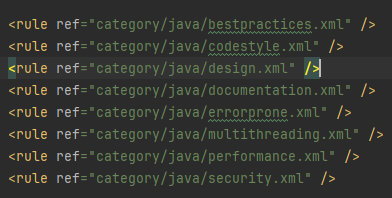
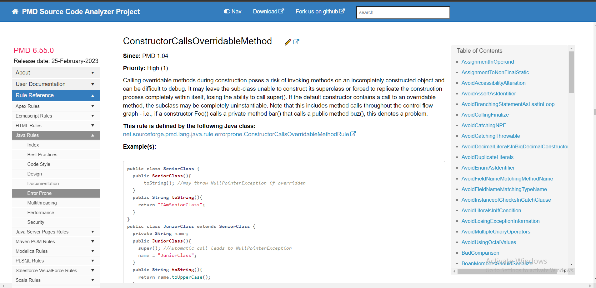

# PMD Code analysis

In our project, we leverage the PMD Maven plugin to perform static code analysis. The PMD Maven plugin seamlessly integrates PMD into our Maven build process, allowing us to identify and address code quality issues as part of our development workflow.

## Setup

To configure PMD code analysis in our project using the Maven plugin, follow these steps:

1. **Add PMD Plugin to `pom.xml`:**
   Include the PMD plugin configuration in the `<build>` section of your project's `pom.xml` file:

      ```xml
    <build>
        <plugins>
            <plugin>
            <groupId>org.apache.maven.plugins</groupId>
                <artifactId>maven-pmd-plugin</artifactId>
                <version>3.21.2</version>
                <configuration>
                    <rulesets>
                        <ruleset>config/pmd-java.xml</ruleset>
                    </rulesets>
                    <maxAllowedViolations>100</maxAllowedViolations>
                </configuration>
                <executions>
                    <execution>
                        <goals>
                            <goal>check</goal>
                            <goal>cpd-check</goal>
                        </goals>
                    </execution>
                </executions>
            </plugin>
        </plugins>
    </build>
   ```
And we specificied PMD rulesets for our project in the (config/pmd-java.xml)


## Running PMD Analysis

```
    $ mvn pmd:check pmd:cpd-check
    //or
    $ mvn verify
```
## Site Plugin
To generate reports and documentation for PMD analysis as part of your project's site
We added Maven-Site-Plugin to our project.
```
<plugin>
    <groupId>org.apache.maven.plugins</groupId>
    <artifactId>maven-site-plugin</artifactId>
    <version>3.7.1</version>
</plugin>
```
For generating a report,

```
    $ mvn site
```
### Interpreting Results
After running PMD analysis, review the generated reports to identify code quality issues detected by PMD. The reports typically include information about each issue, including the affected files, line numbers, and a description of the problem.


### More detailed solutions


**Initial PMD analysis:**


**After addressing the violations and fixing the code smells:**


### Summary
By utilizing the PMD Maven plugin in our project, we could be able to incorporate static code analysis into our Maven build process.
This enabled us to identify and address code quality issues during the development cycle.
By collaborating closely with the test team, we utilized PMD analysis reports to efficiently address bugs, code quality issues. 


